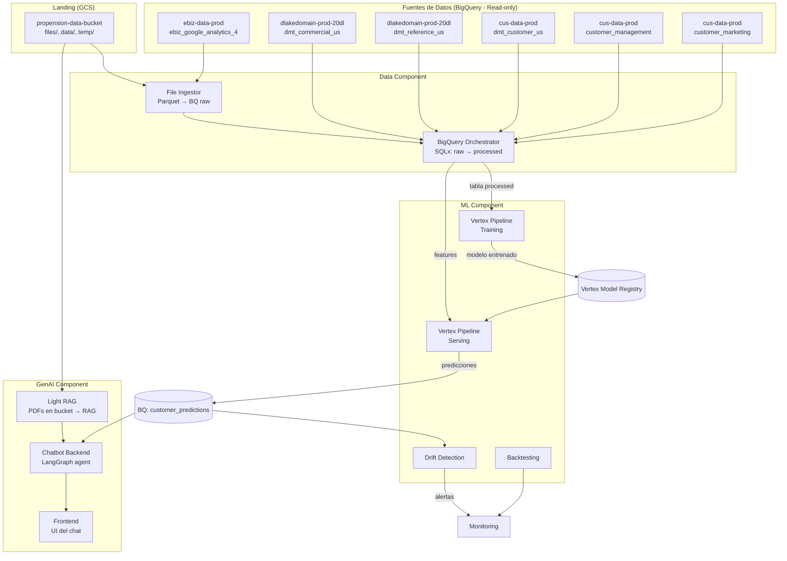

# 01 — Arquitectura General

## ¿Qué vas a construir?

Un **Data Product completo** que predice la propensión de compra de tickets de un cliente, con un chatbot que puede responder preguntas sobre documentos corporativos Y sobre predicciones específicas.

## Diagrama (Mermaid)

## Los 3 componentes (en una vista)

| Componente | Input | Output | Tecnología |
|---|---|---|---|
| **Data** | GA4 (Parquet) + 5 tablas BQ | Tabla `hands_on_master_cl` (features) | File Ingestor + BQO (Dataform) |
| **ML** | Tabla de features | Modelo entrenado + predicciones | Vertex AI Pipelines + XGBoost + MLflow |
| **GenAI** | PDFs + predicciones ML | Chat que responde en lenguaje natural | Light RAG + LangGraph + Cloud Run |

## Conexiones clave

1. **Data → ML**: la tabla `hands_on_master_cl` (processed) alimenta el training pipeline.
2. **ML → BigQuery**: las predicciones se guardan en `customer_predictions`.
3. **Data → Bucket → Light RAG**: PDFs en `gs://bucket/files/` son ingestados por Light RAG.
4. **ML + Light RAG → Chatbot**: el chatbot LangGraph tiene 2 tools (consulta Light RAG + consulta predicciones ML).
5. **Bucket → ML (opcional)**: el Cloud Run Job `data-to-bucket` puede llevar predicciones al bucket para que Light RAG las indexe.

## Stack tecnológico

- **GCP**: BigQuery, Cloud Storage, Cloud Run, Cloud Scheduler, Vertex AI
- **Terraform**: módulos de `terraform-modules-cosmos-common`
- **Dataform** (BQO): SQLx
- **Vertex AI Pipelines** (KFP): para ML
- **LangGraph**: para el agente GenAI
- **Light RAG**: RAG sobre PDFs
- **GitLab CI/CD**: para todo el flujo
- **MLflow**: para tracking de experimentos

---

**Siguiente**: [`02-componentes.md`](./02-componentes.md) — detalle por servicio.
