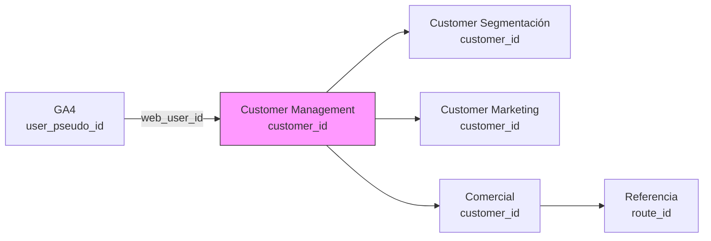

# 03 — Fuentes de Datos

El hands-on usa **6 fuentes de datos de producción** de LATAM. Las necesitás solicitar por **Data Hub** (https://data-management.appslatam.com/). El proceso tarda **1-2 días hábiles** — solicitá AL INICIO.

## Resumen ejecutivo

| # | Fuente | Tabla | Caso de uso | Tamaño aprox |
|---|---|---|---|---|
| 1 | GA4 | `ebiz-data-prod.ebiz_google_analytics_4` | Comportamiento web (clicks, páginas vistas, eventos) | Alta cardinalidad |
| 2 | Comercial | `dlakedomain-prod-20dl.dmt_commercial_us` | Ventas, reservas, transacciones, RFM | Media |
| 3 | Referencia | `dlakedomain-prod-20dl.dmt_reference_us` | Rutas, aeropuertos, productos, ancillary | Baja |
| 4 | Customer (segmentación) | `cus-data-prod.dmt_customer_us` | Segmentos de clientes, RFM, lifetime value | Media |
| 5 | Customer (gestión) | `cus-data-prod.customer_management` | Identidad única de clientes, mapeo | Baja |
| 6 | Customer (marketing) | `cus-data-prod.customer_marketing` | Campañas, comunicación, engagement | Media |

---

## 1. Google Analytics 4 (`ebiz-data-prod.ebiz_google_analytics_4`)

**Descripción**: Eventos de Google Analytics 4 del sitio web de LATAM (vistas de página, clicks en productos, búsquedas, add-to-cart, etc.).

**Uso en el hands-on**: Feature engineering para el modelo. Eventos como `view_item`, `add_to_cart`, `begin_checkout` son señales fuertes de intención de compra.

**Cómo se ingiere**: NO se consulta directo en BQO. Primero se baja como Parquet a GCS, después el File Ingestor la lleva a una tabla raw (`mst_all_hits`).

**Schema de la tabla raw** (referencia, copiar de `new-hire-integration/assets/biglake_table.json`):
- `event_date` (DATE)
- `event_name` (STRING) — ej. `page_view`, `view_item`, `purchase`
- `user_pseudo_id` (STRING) — ID anónimo de GA4
- `page_location` (STRING)
- `page_title` (STRING)
- `geo_country` (STRING)
- `device_category` (STRING) — desktop, mobile, tablet
- `traffic_source` (STRING)
- ... (~50 columnas más)

**Cardinalidad esperada**: ~100M eventos/mes en producción. En sandbox: 1-10M.

---

## 2. Comercial (`dlakedomain-prod-20dl.dmt_commercial_us`)

**Descripción**: Datos transaccionales del sistema comercial (reservas, tickets emitidos, pagos, cancelaciones, cambios).

**Uso en el hands-on**: 
- **Label del modelo**: ¿compró ticket en los próximos 30 días? (target binario)
- Features: histórico de compras, frecuencia, gasto promedio, recencia.

**Schema aproximado**:
- `booking_id` (STRING) — PK
- `customer_id` (STRING) — FK a customer_management
- `booking_date` (DATE)
- `ticket_amount` (NUMERIC)
- `origin` (STRING) — código IATA
- `destination` (STRING) — código IATA
- `cabin_class` (STRING) — economy, premium, business
- `status` (STRING) — confirmed, cancelled, flown

**Cardinalidad**: ~5M bookings/mes.

---

## 3. Referencia (`dlakedomain-prod-20dl.dmt_reference_us`)

**Descripción**: Datos maestros de rutas, aeropuertos, productos, servicios ancillary.

**Uso en el hands-on**: Enriquecer bookings con info de ruta (distancia, mercado, estacionalidad).

**Schema aproximado**:
- `route_id` (STRING)
- `origin_iata` (STRING)
- `destination_iata` (STRING)
- `distance_km` (INT)
- `market` (STRING) — domestic, regional, international
- `is_seasonal` (BOOL)

**Cardinalidad**: Baja (~10K rutas).

---

## 4. Customer Segmentación (`cus-data-prod.dmt_customer_us`)

**Descripción**: Segmentos de clientes pre-calculados por el equipo de CRM (RFM, lifetime value, preferencias).

**Uso en el hands-on**: Features demográficas y de segmentación para el modelo.

**Schema aproximado**:
- `customer_id` (STRING)
- `rfm_segment` (STRING) — Champions, Loyal, At Risk, etc.
- `ltv` (NUMERIC) — lifetime value
- `preferred_cabin` (STRING)
- `loyalty_tier` (STRING) — base, premium, signature

**Cardinalidad**: ~15M clientes únicos.

---

## 5. Customer Management (`cus-data-prod.customer_management`)

**Descripción**: Tabla maestra de identidad de clientes. Mapea distintos IDs (booking, loyalty, web) a un `customer_id` único.

**Uso en el hands-on**: Join key entre GA4 (user_pseudo_id), bookings (customer_id), y customer_segmentation.

**Schema aproximado**:
- `customer_id` (STRING) — PK
- `loyalty_id` (STRING) — número LATAM Pass
- `email_hash` (STRING)
- `web_user_id` (STRING) — para cruzar con GA4
- `created_at` (DATE)

**Cardinalidad**: ~15M clientes únicos.

---

## 6. Customer Marketing (`cus-data-prod.customer_marketing`)

**Descripción**: Historial de campañas de marketing (emails, push notifications, ofertas recibidas, ofertas redimidas).

**Uso en el hands-on**: Features de engagement y respuesta a campañas.

**Schema aproximado**:
- `customer_id` (STRING)
- `campaign_id` (STRING)
- `campaign_date` (DATE)
- `channel` (STRING) — email, push, sms
- `sent` (BOOL)
- `opened` (BOOL)
- `clicked` (BOOL)
- `redeemed` (BOOL) — usó la oferta

**Cardinalidad**: ~50M eventos de campañas/mes.

---

## Flujo de joins (cómo se conectan)

**Customer Management es el hub.** Todo pasa por `customer_id`.

---

## Cómo solicitar acceso

**DÓNDE**: https://data-management.appslatam.com/

**PROCESO**:
1. Iniciá sesión con tu cuenta LATAM
2. Click en "Nueva solicitud"
3. Llená:
   - **Caso de uso**: "Desarrollo de modelo de propensión de compra para onboarding Cosmos"
   - **Justificación**: "Acceso requerido para entrenamiento de modelo ML como parte del hands-on de onboarding"
   - **Duración**: 2-3 semanas (período del hands-on)
   - **Product Name**: `nelson-acosta-ob`
   - **Team**: tu equipo de dominio
   - **Environment**: dev
4. Esperá aprobación (1-2 días hábiles)
5. Una vez aprobado, ya podés leer las tablas desde BQO

**IMPORTANTE**: 
- Solicitá las 6 fuentes en una sola tanda
- Mientras esperás, seguí con los pasos que NO requieren datos (crear el producto, infra base, etc.)

---

## Permisos especiales

Una vez aprobado, tu Service Account del BQO (`nelson-acosta-ob-bqo-sa@<project>.iam.gserviceaccount.com`) necesita:

| Permiso | Recurso | Para qué |
|---|---|---|
| `roles/bigquery.dataViewer` | Las 6 tablas fuente | Leer en SELECT |
| `roles/bigquery.jobUser` | El proyecto | Correr queries |

Pedí esto a tu Staff o en el mismo Data Hub.

---

**Siguiente**: [`04-deployment.md`](./04-deployment.md) — CI/CD y flujo de deploy.
