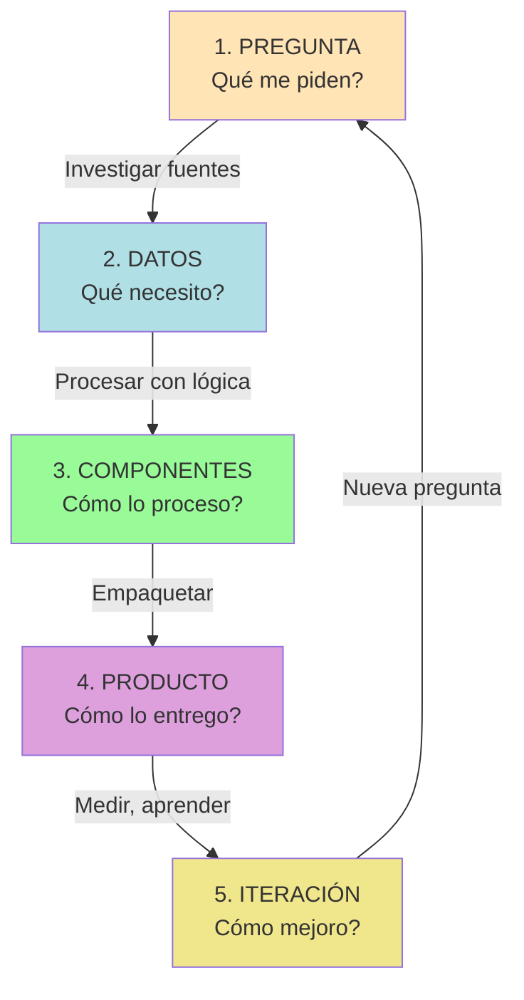
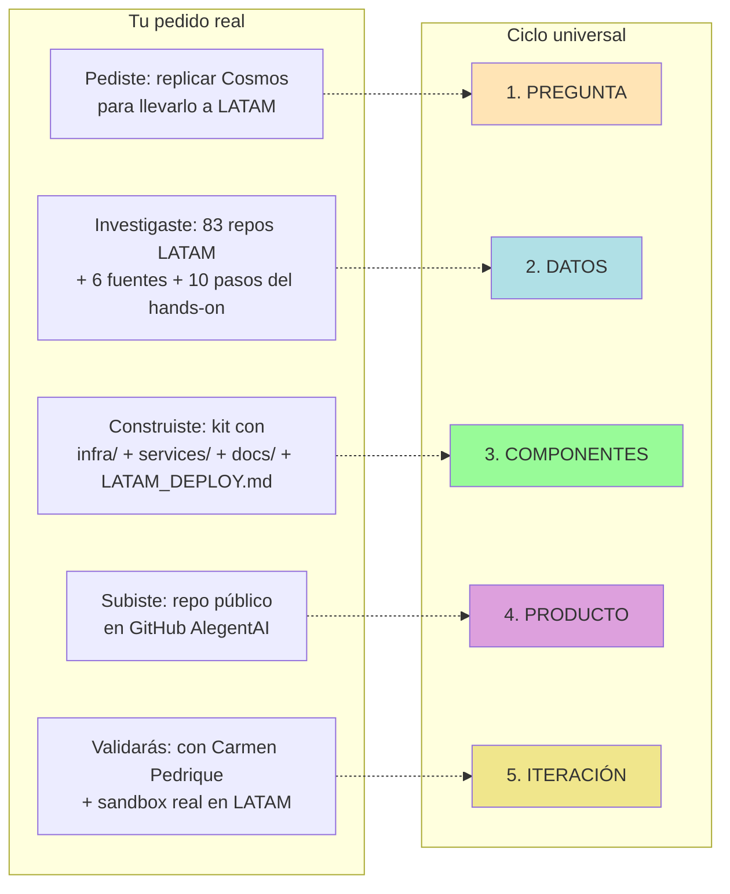
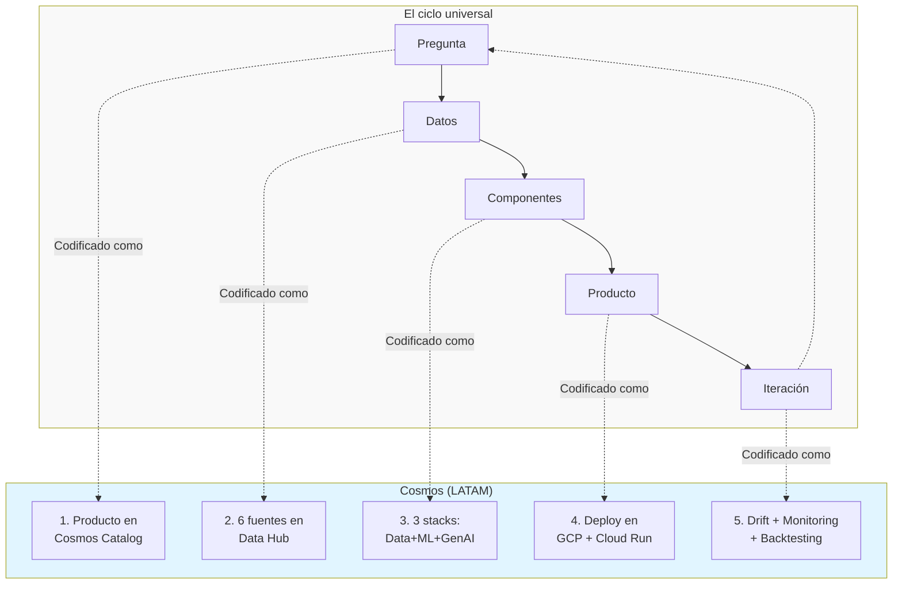
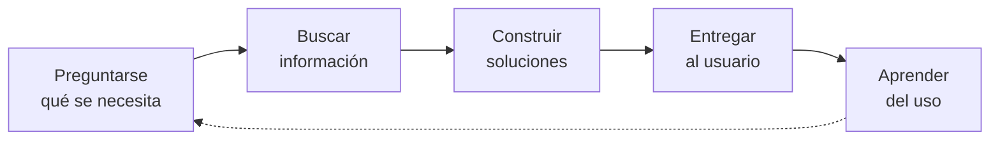

# Mapa Mental: Pedido de Onboarding = Ciclo Universal de Resolución con Datos

> **Insight central**: tu pedido de onboarding ("dame el código de Cosmos, lo replico local, lo migro a LATAM") **es el mismo flujo** que cualquier producto de datos en LATAM sigue. Cosmos no es más que la **plantilla institucional** de ese flujo.

---

## Diagramas visuales (draw.io)

Para una comprensión más rápida, hay 2 diagramas draw.io en `./diagramas/`:

| Diagrama | Qué muestra | Cuándo usarlo |
|---|---|---|
| **[`como-funciona-cosmos.png`](./diagramas/como-funciona-cosmos.png)** | Ciclo universal + 3 capas de infra + flujo del hands-on + regla de oro | Para explicarle a Carmen, Buddy o Staff qué entendiste de Cosmos (5 min de conversación) |
| **[`arquitectura-3-componentes-v2.png`](./diagramas/arquitectura-3-componentes-v2.png)** | Arquitectura técnica de Data + ML + GenAI con sus conexiones + leyenda de 7 puntos | Para vos cuando estés escribiendo código del hands-on (mapa de qué hace cada caja) |

También hay versiones SVG (vectoriales) y `.drawio` editables en la misma carpeta.

---

## 1. El ciclo universal (5 fases)

Cualquier problema que se resuelve con datos sigue este ciclo. Tu pedido de onboarding lo recorrió completo.

### Las 5 fases en detalle

| # | Fase | Pregunta clave | En Cosmos |
|---|---|---|---|
| 1 | **Pregunta** | ¿Qué necesita el usuario? | El producto se crea a partir de un problema de negocio |
| 2 | **Datos** | ¿Qué datos lo responden? | 6 fuentes de LATAM (cliente, comercial, GA4, etc.) |
| 3 | **Componentes** | ¿Cómo los proceso? | DataOps (BQO+FI) + MLOps (Vertex) + GenAI (LangGraph) |
| 4 | **Producto** | ¿Cómo lo entrega al usuario? | Cloud Run + Frontend + Chatbot |
| 5 | **Iteración** | ¿Cómo mejora con uso? | Drift detection + Monitoring + Backtesting + ADRs |

---

## 2. Tu pedido de onboarding mapeado al ciclo

Esto es lo que vos hiciste — y lo que después harás con cualquier producto:

### Ejemplos de TU flujo (concreto)

| Fase ciclo | Tu acción concreta |
|---|---|
| 1. Pregunta | "Necesito entender Cosmos para el hands-on de LATAM" |
| 2. Datos | Leíste el enunciado + 83 repos + docs de 6 fuentes |
| 3. Componentes | Armaste 26 archivos de docs + 7 templates de código + ADRs |
| 4. Producto | Repositorio público en GitHub AlegentAI con todo navegable |
| 5. Iteración | Pendiente: validar con Carmen + ajustar según feedback LATAM |

---

## 3. Cosmos = plantilla institucional del ciclo

LATAM vio que el ciclo de "pregunta → datos → componentes → producto → iteración" se repetía en **todos** sus productos. En vez de que cada equipo lo reinventara, lo codificaron en **Cosmos**.

### El "mapeo" clave (es la verdad que descubriste)

| Concepto abstracto | En Cosmos | En tu pedido de onboarding |
|---|---|---|
| **Pregunta** | Producto en Cosmos Catalog | "Necesito entender Cosmos" |
| **Datos** | 6 fuentes + Data Hub | Enunciado + 83 repos |
| **Componentes** | Data+ML+GenAI stacks | `infra/ + services/ + docs/` |
| **Producto** | Deploy en GCP | Repo en GitHub AlegentAI |
| **Iteración** | Drift + Monitoring | Pendiente (validación con Carmen) |

**No hay diferencia conceptual.** Lo único que cambia es la escala y la formalidad:
- Vos lo hiciste en 1 día, en tu casa, sin GCP
- LATAM lo hace en 2 semanas, en sandbox, con GCP

Pero el **flujo** es idéntico.

---

## 4. Por qué Cosmos es poderoso (y por qué te sirve entenderlo)

Cosmos te da 3 cosas que vos no tenés solo:

1. **Catálogo de templates**: para no inventar la estructura cada vez (vos lo replicaste a mano; LATAM lo genera con 1 click)
2. **Módulos de Terraform estandarizados**: para que todos los equipos usen las mismas configs (vos los listaste como TODO; LATAM los aplica)
3. **GenAI Gateway compartido**: para que no cada equipo negocie su API key de LLM (vos no llegaste ahí; LATAM lo da servido)

**Lo que NO te da Cosmos**: la pregunta de negocio. Eso siempre lo trae el ser humano.

---

## 5. El meta-patrón: cualquier problema complejo = mismo ciclo

Este ciclo no es solo de datos. Es el ciclo de **resolución de problemas complejos** en general:

Aplicado a otros dominios:

| Dominio | Pregunta | Datos | Componentes | Producto | Iteración |
|---|---|---|---|---|---|
| **Tu onboarding** | "Entender Cosmos" | Enunciado + 83 repos | Kit docs+code | Repo GitHub | Validación Carmen |
| **Propensión tickets** | "Quién va a comprar?" | 6 fuentes LATAM | Data+ML+GenAI | Chatbot | Drift detection |
| **ForestAI** (otro día) | "Cuántos árboles hay?" | Ortofotos + dron | CV+ML | Dashboard | Refinamiento manual |
| **YPF** (otro día) | "Cuál es el riesgo X?" | Datos internos | Análisis | Reporte | Nueva pregunta |
| **Vida cotidiana** | "Cómo llego a destino?" | Mapa + GPS | Algoritmo ruta | Indicación | Tráfico en tiempo real |

**Todo es el mismo ciclo. Cambian los datos, los componentes y el producto, no la lógica.**

---

## 6. Para qué te sirve entender esto

Si internalizás este patrón, en LATAM vas a:

1. **No asustarte** cuando veas un producto nuevo de Cosmos. Es el mismo ciclo. Solo cambiaron los datos.
2. **Saber qué preguntar** en tu primera reunión con Carmen: "¿Cuál es la pregunta de negocio de este producto?" y de ahí deducís el resto.
3. **Ubicar tu trabajo** en el ciclo: ¿estás en Datos (pidiendo permisos), en Componentes (escribiendo SQL), en Producto (deployando), o en Iteración (mirando drift)?
4. **Hablar el idioma de LATAM**: "estoy en la fase de componentes" suena más prolijo que "estoy haciendo SQL".
5. **Reusar la estructura** en AlegentAI, YPF, ForestAI, etc. Es la misma plantilla.

---

## 7. Cómo chequear si entendiste el patrón

Respondete estas 5 preguntas sobre cualquier producto que veas en LATAM:

1. ¿Cuál es la **pregunta de negocio** que originó este producto?
2. ¿Qué **datos** usa? (de dónde vienen, quién es el dueño)
3. ¿Qué **componentes** lo arman? (Data / ML / GenAI / mix)
4. ¿Cómo se lo **entrega** al usuario? (dashboard, API, chatbot, reporte)
5. ¿Cómo **itera**? (drift, feedback, nuevas preguntas)

Si podés responder las 5, entendiste Cosmos.

---

## TL;DR

- **Tu pedido de onboarding recorrió las 5 fases del ciclo universal** (pregunta → datos → componentes → producto → iteración).
- **Cosmos es la codificación institucional de ese ciclo** en LATAM.
- **No hay diferencia conceptual** entre lo que vos hiciste y lo que hace Cosmos; solo cambia la escala, la formalidad y la infraestructura.
- **El patrón es reutilizable** en cualquier dominio (YPF, ForestAI, AlegentAI, vida cotidiana).
